# Práctica Final ORM Django

## Datos del estudiante

Nombre: Mauricio Brante Oliva

Correo: mauricio.brante@gmail.com

Curso: Python 0068

## Descripción general del proyecto

Se implementó un CRUD completo para gestionar laboratorios en Django, incluyendo funcionalidades para crear, listar, actualizar y eliminar laboratorios, y se añadieron pruebas unitarias para verificar que los datos, las URLs y las plantillas de las vistas funcionen correctamente.

## Credenciales de usuarios

### Super Usuario:
Usuario: admin
Email: admin@admin.com
Constraseña: admin

## Instrucciones para la restauración de la bases de datos

1. Crear base de datos con el nombre
2. Generar restauración desde el archivo backup.tar
3. Verificar en settings.py que el usuario de contraseña de la conexión coincidan con los suyos.

Editar el código:

```
DATABASES = {
    "default": {
        "ENGINE": "django.db.backends.postgresql",
        "NAME": "db_final_orm",
        "USER": "<nombre usuario>",
        "PASSWORD": "<password>",
        "HOST": "127.0.0.1",
        "PORT": "5432",
    }
}
```


## Instrucciones para levantar el proyecto

1. Generar el entorno virtual

```
python -m venv venv
```

2. Instalar las dependencias de requirements.txt

```
pip install -r requirements.txt
```

3. Levantar el proyecto

```
py.exe .\manage.py runserver
```

## Evidencias


### Parte 1

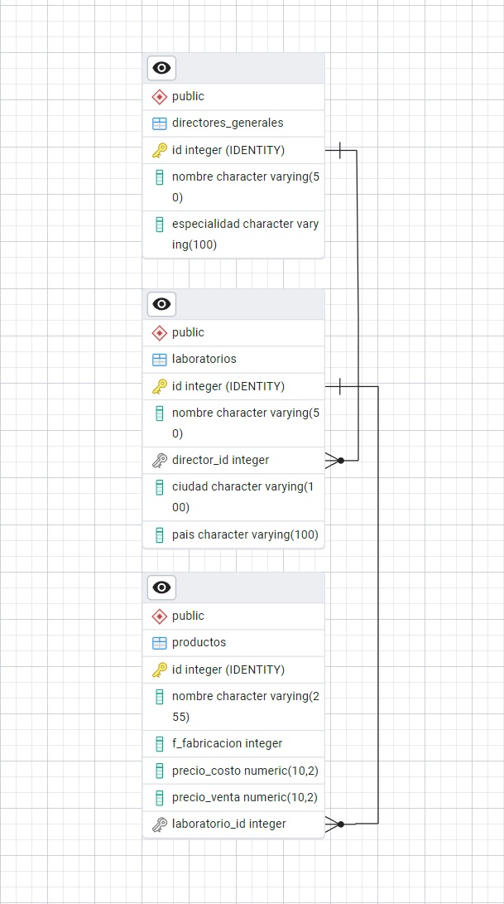

### Parte 2


1. Interfaz django 1


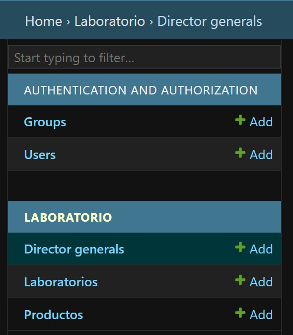


2. Interfaz django 2


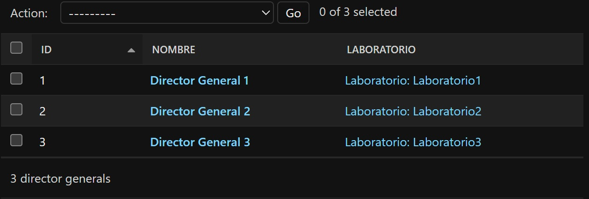


3. Interfaz django 3


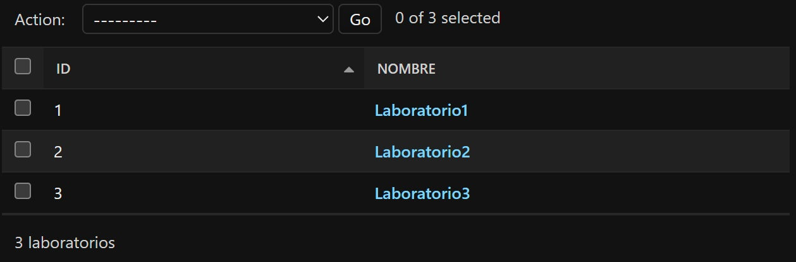


4. Interfaz django 4


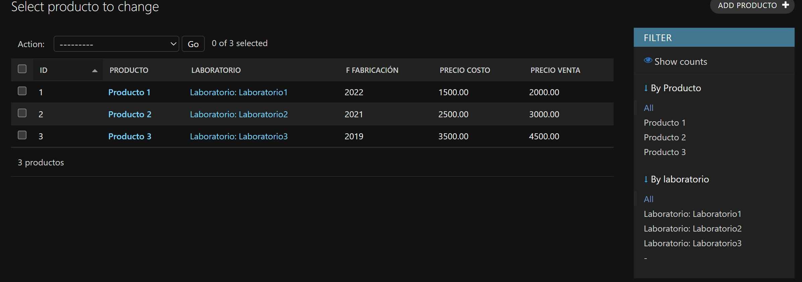


5. Consulta Powershell 1


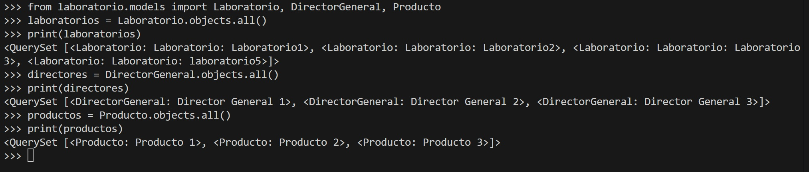


6. Consulta Powershell 2


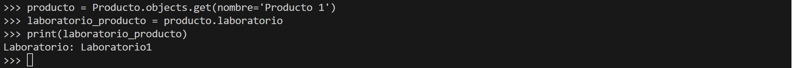


7. Consulta Poweshell 3


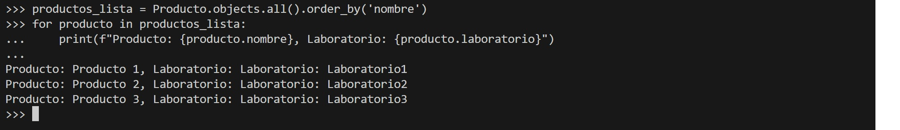


8. Consulta Powershell 4


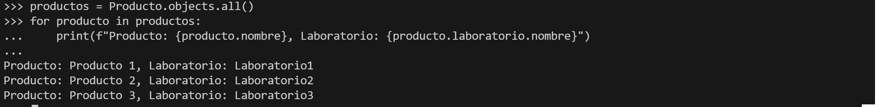

### Parte 3

1. CRUD - CREATE 1


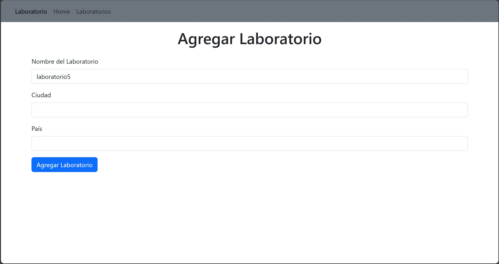


2. CRUD - CREATE 2


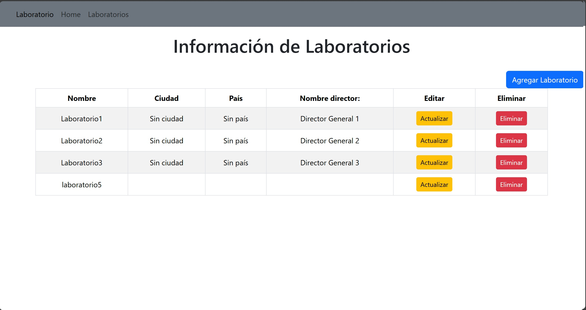


3. CRUD - READ 1


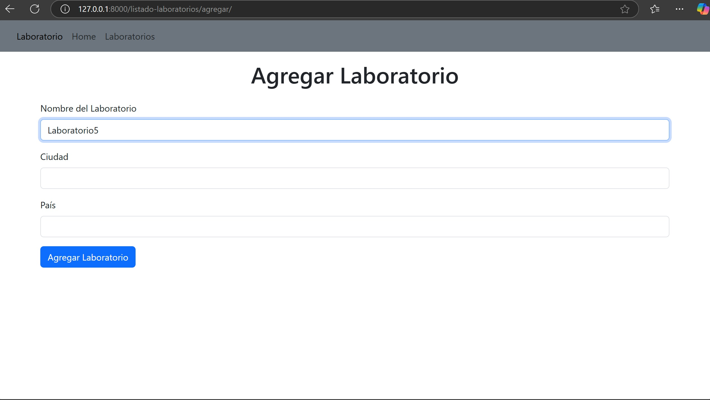


4. CRUD - READ 2


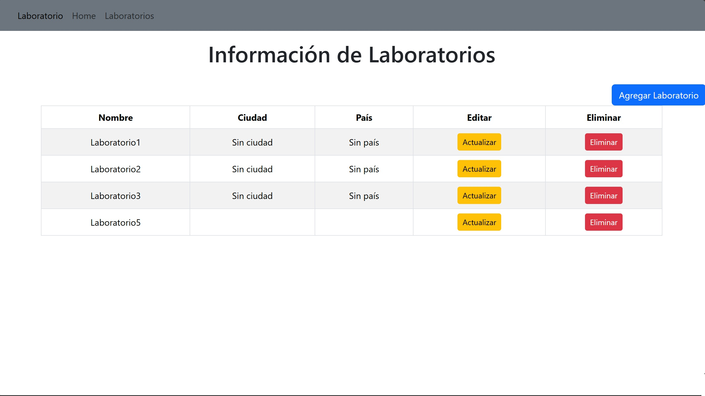


5. CRUD - UPDATE 1


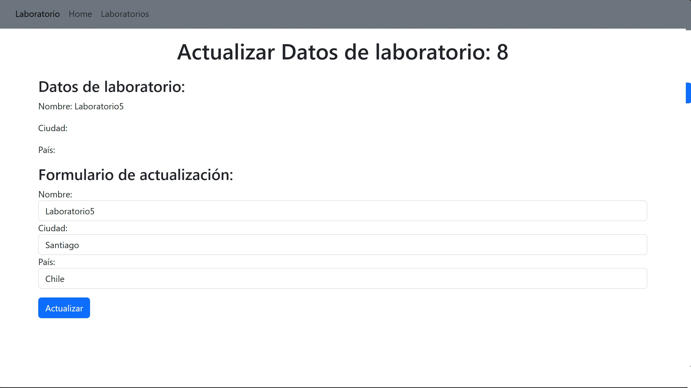


6. CRUD - UPDATE 2


7. CRUD - DELETE 1


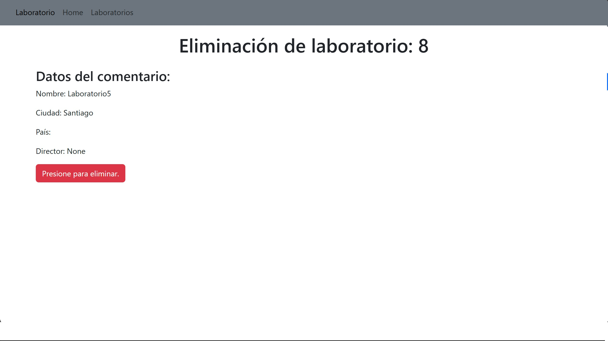

8. CRUD - DELETE 2


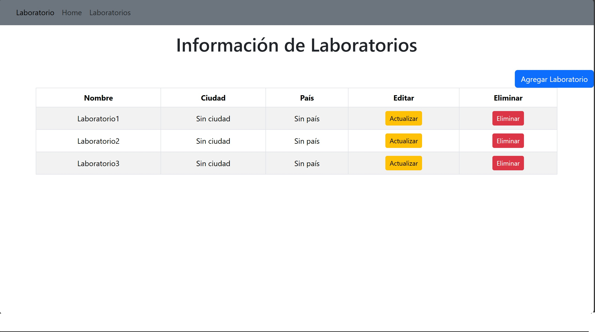


9. Migraciones con actualziación


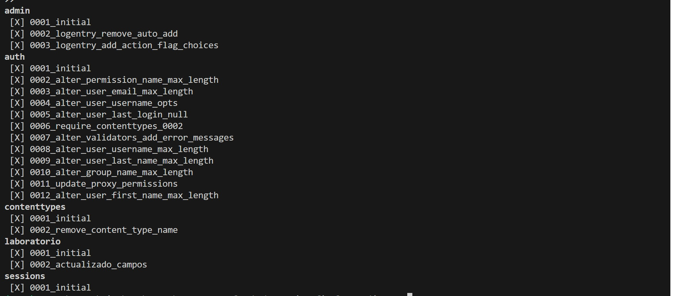

### Parte 4

1. Test

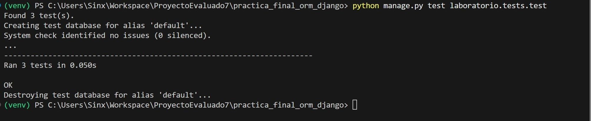